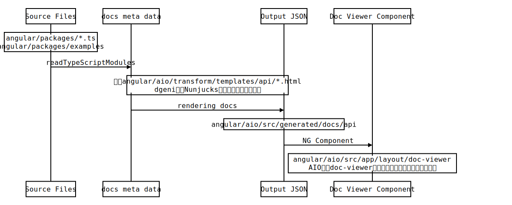
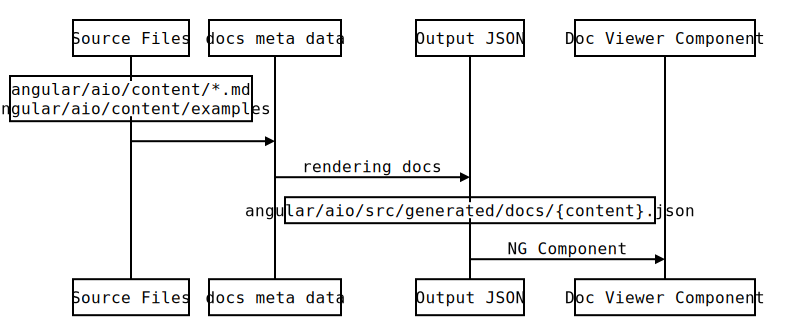

# Angular X 项目自动生成说明文档

---

## 背景介绍
每个公司/项目因为业务需要，都会沉淀一套自己的框架/组件库出来。出于后续维护方面的考虑，我们非常希望能够有完善的文档说明，来描述组件概览，设计理念，接口说明，代码示例，FAQ等内容。那么我们应该如何去创建、维护这些文档说明呢？ 介于本人只做前端开发，该文将以Angular及几个流行的NG周边组件库为例，解释其中的文档生成方式，共同学习.

## Angular
- [Angular官方文档](https://angular.io)
- [Angular中文文档](https://angular.cn)
- [Angular文档网站源代码](https://github.com/angular/angular/tree/master/aio)

Angular官方文档主要包括两部分内容
### API文档
用来描述说明Angular框架中的各个模块、类、接口。
此类文档的内容是直接写在源代码（`angular/packages`）中，编译时使用工具自动提取生成的。
其中API条目的具体说明是以[JSDoc](http://usejsdoc.org/)的形式书写的，而对应的Overview, Description内容则是以[Markdown](https://segmentfault.com/markdown)的形式书写的
### 其他文档
其他文档主要包括“快速上手”，“教程”，“核心知识”，“市场营销”等。
此类文档内容是写在`angular/aio/content`文件夹中。
### 自动化工具
- 包管理工具： `yarn`
- 文档生成工具： [dgeni](https://github.com/angular/dgeni)
- 文档生成命令： `yarn docs`

#### `yarn docs`原理说明
自动生成文档工具脚本路径在`angular/aio/tools/transforms/`。他以`angular-base-package`, `angular-api-package`, `angular-content-package`三个dgeni package来组织文档自动生成的业务逻辑。


##### API文档生成示意图

```seq
Note over Source Files: angular/packages/*.ts\n angular/packages/examples
Source Files->docs meta data: readTypeScriptModules
Note over docs meta data, Output JSON: 模板angular/aio/transform/templates/api/*.html\n dgeni使用Nunjucks模板引擎渲染模板内容
docs meta data->Output JSON: rendering docs
Note over Output JSON: angular/aio/src/generated/docs/api
Output JSON->Doc Viewer Component: NG Component
Note over Doc Viewer Component: angular/aio/src/app/layout/doc-viewer\n AIO实用doc-viewer组件加载文档内容并显示在页面上
```
##### 其他类型文档（“快速上手”，“教程”，“核心知识”，“市场营销”）生成示意图

```seq
Note over Source Files: angular/aio/content/*.md\n angular/aio/content/examples
Source Files->docs meta data: 
docs meta data->Output JSON: rendering docs
Note over Output JSON: angular/aio/src/generated/docs/{content}.json
Output JSON->Doc Viewer Component: NG Component
```

#### `yarn docs`详细流程说明
完整的文档生成流程包括以下环节, 脚本工具主要在`processing-docs`和`docs-rendered`两个环节中处理:
##### 1. reading-files (defined in base)
##### 2. files-read (defined in base)
##### 3. parsing-tags (defined in jsdoc)
##### 4. tags-parsed (defined in jsdoc)
- apiPackage
    - addNotYetDocumentedProperty (标注没有文档说明的API)
##### 5. extracting-tags (defined in jsdoc)
##### 6. tags-extracted (defined in jsdoc)
##### 7. processing-docs (defined in base)
- basePackage
    - createOverviewDump (提取module类型的文档说明到overview-dump.html中)
- apiPackage
	- convertPrivateClassesToInterfaces
	- mergeDecoratorDocs (处理装饰器说明文档)
	- extractDecoratedClasses ()
	- addMetadataAliases (针对directive, component, pipe类型aliases的提取)
##### 8. docs-processed (defined in base)
- apiPackage
	- markBarredODocsAsPrivate (将ɵ标记的特殊文档标记为privateExport)
##### 9. adding-extra-docs (defined in base)
##### 10. extra-docs-added (defined in base)
- apiPackage
	- generateApiListDoc (解析Directive装饰器的说明文档)
	- filterContainedDocs, filterPrivateDocs (移除重复说明文档)
	- simplifyMemberAnchors 
##### 11. computing-ids (defined in base)
##### 12. ids-computed (defined in base)
- apiPackage
	- computeSearchTitle ()
##### 13. computing-paths (defined in base)
##### 14. paths-computed (defined in base)
- apiPackage
	- matchUpDirectiveDecorators
- aioPackage
	- processNavigationMap
##### 15. rendering-docs (defined in base)
##### 16. docs-rendered (defined in base)
- postProcessPackage
	- postProcessHtml
- basePackage
	- generateKeywords
	- checkUnbalancedBackTicks (检查markdown代码片断结束开始符是否匹配)
	- fixInternalDocumentLinks (修复文档内部hash链接)
	- renderLinkInfo (为文档生成HTML注释，说明该文档引用了哪些链接，以及该文档在哪里被引入)
	- convertToJson (将文档说明转成JSON字符串)
	- copyContentAssets (将`angular/aio/content/images`拷贝至``angular/aio/src/generated/images``)
	- autoLinkHeadings (为文档h1-h6增加内部hash链接)
##### 17. writing-files (defined in base)
##### 18. files-written (defined in base)


## 参考资料


